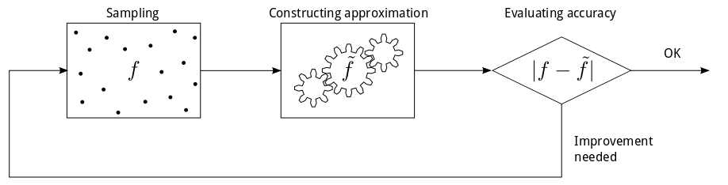

##SPLINTER
SPLINTER (SPLine INTERpolation) is a function approximation library implementing various multivariate function approximation methods in C++. With SPLINTER you can approximate any function in any number of variables using the following implementations:

1. a speedy implementation of the tensor product [B-spline](http://en.wikipedia.org/wiki/B-spline), and 
2. a simple implementation of [radial basis function splines](http://en.wikipedia.org/wiki/Radial_basis_function), including the [thin plate spline](http://en.wikipedia.org/wiki/Thin_plate_spline).

The B-spline may approximate any multivariate function sampled on a grid. The user may construct a linear (degree 1), quadratic (degree 2) or cubic (degree 3) spline that interpolates the data. The B-spline is constructed from the samples by solving a linear system. On a modern desktop computer the practical limit on the number of samples is about 100 000 when constructing a B-spline. However, evaluation time is independent of the number of samples due to the local support property of B-splines. That is, only samples neighbouring the evaluation point affect the B-spline value. Evaluation do however scale with the degree and number of variables of the B-spline.

The user may create a penalized B-spline (P-spline) that smooths the data instead of interpolating it. The construction of a P-spline is more computationally demanding than the B-spline - a large least-square problem must be solved - bringing the practical limit on the number of samples down to about 10 000.

When sampling is expensive and/or scattered (not on a grid) the radial basis function splines may be utilized for function approximation. The user should expect a high computational cost for constructing and evaluating a radial basis function spline, even with a modest number of samples (up to about 1 000 samples). 

Figure: Illustration of a cubic B-spline generated with the SPLINTER library.

The workflow to construct an approximation is simple: sample a function and construct an approximation. As the following figure illustrates, this process can be run iteratively until a satisfactory approximation has been built. To assess the accuracy of the approximation one can use existing samples for cross-validation or perform additional sampling. Note that the current version of SPLINTER only facilitates sampling and model construction. 

Figure: A possbile workflow for building approximations with SPLINTER.

###Sharing
SPLINTER is the result of several years of development towards a fast and general library for function approximation. The initial intention with the library was to build splines for use in mathematical programming (nonlinear optimization). Thus, some effort has been put into functionality that supports this, e.g. Jacobian and Hessian computations for the B-spline. The current goals with the library are: 1) to improve the current code and make it more accessible for users (for instance by adding a Matlab and Python interface), and 2) to implement and test new function approximation methods.

By making SPLINTER publicly available we hope to help anyone looking for a multivariate function approximation library. In return,  we expect nothing but your suggestions, improvements, and feature requests. As the TODO-list reflects, there is still much honing to be done!

Please let us know by what you think about the library. Together we can make a great library - one that appears to be simple and dull, but that is packing some serious horsepower under the hood.

###Requirements for use
* [Eigen](http://eigen.tuxfamily.org/index.php?title=Main_Page) (tested with versions 3.2.1, 3.2.2 and 3.2.3)

Note that the sparse matrix support of Eigen is particularly important for the speed of the tensor product B-spline implementation.

###Guides
* [Installation](docs/install.md)
* [Basic usage](docs/basic_usage.md)
* [MatLab interface](docs/MATLAB.md)
